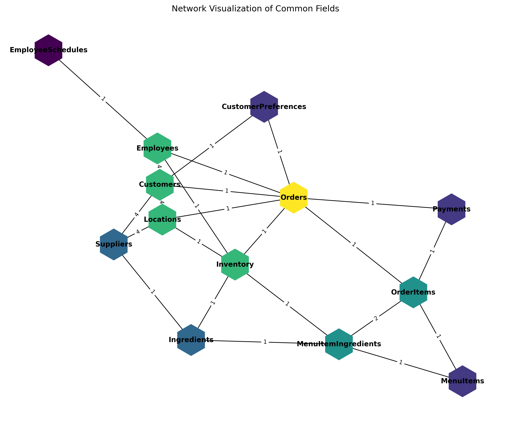
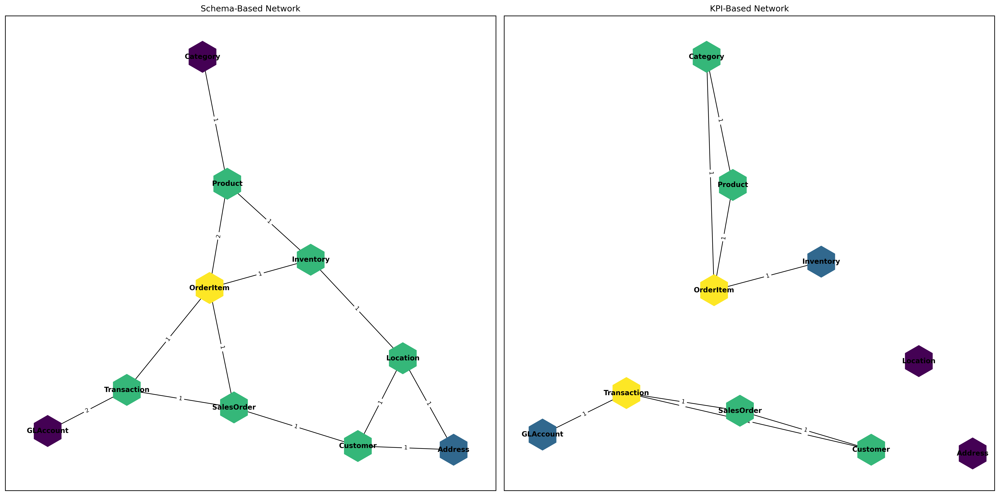

# Moria Data Readiness Engine

The Moria Data Readiness Engine is a tool designed to analyze relationships and interconnectivity between datasets. It provides insights into schema relationships, KPI-based connections, and network visualizations to help users understand their data better.

---


## Features
- **Schema Analysis**: Analyze relationships between tables based on shared fields.
- **KPI-Based Analysis**: Identify connections between tables based on shared KPIs.
- **Network Visualization**: Generate interactive and static visualizations of schema and KPI-based networks.
- **Graph-Theory Insights**: Leverage graph-theory algorithms (such as centrality measures, community detection, and path analysis) to identify the most important nodes (tables) and highlight critical missing links or connections in your data network. This approach helps uncover gaps, bottlenecks, or opportunities to strengthen data integration across datasets.
- **Customizable Workflows**: Easily extendable for different datasets and use cases.

---

## Project Structure
- `moria_engine/`: Core package containing the engine's logic.
  - `analysis/`: Functions for data analysis and visualization.
  - `data/`: Data loaders and preprocessors.
- `tests/`: Unit and integration tests for the project.
- `notebooks/`: Jupyter notebooks for experimentation and prototyping.
- `data/`: Raw and processed datasets.
- `docs/`: Documentation and guides.

---

## Installation
1. Clone the repository:
   ```bash
   git clone https://github.com/moria-ai-labs/data_readiness.git
   cd moria_engine 
   ```
2. Create a virtual environment (recommended)

3. Install dependencies:
   ```bash
   pip install -r requirements.txt
   ```

---

## Usage

To get started with the Moria Data Readiness Engine, you can use the following examples to generate schema-based and KPI-based matrices from your data:

### Schema-Based Matrix

```python
import pandas as pd
from moria_engine.analysis.data_transformers import build_common_fields_matrix_schema

# Example DataFrame
df_schema = pd.DataFrame({
    "domain_name": ["Domain1", "Domain1", "Domain2"],
    "table_name": ["Table1", "Table2", "Table3"],
    "field_name": ["Field1", "Field2", "Field3"]
})

# Generate the schema-based matrix
matrix, table_names, table_to_domain = build_common_fields_matrix_schema(df_schema)
```

### KPI-Based Matrix

```python
import pandas as pd
from moria_engine.analysis.data_transformers import build_common_fields_matrix_kpis

# Example DataFrame
df_kpis = pd.DataFrame({
    "kpi_name": ["KPI1", "KPI2"],
    "domain_name": ["Domain1", "Domain2"],
    "table_name": ["Table1", "Table2"]
})

# Generate the KPI-based matrix
matrix, table_names, table_to_domain, table_to_kpi = build_common_fields_matrix_kpis(df_kpis)
```



These examples demonstrate how to import the necessary functions, prepare your data in DataFrames, and generate the schema-based and KPI-based matrices, which can be used for further analysis and visualization.



### Network Analysis and Advance Usage

#### Visualize and Compare Schema and KPI Networks
```python 
from moria_engine.analysis.graph_visualizer import visualize_combined_networks1

# Visualize both networks side by side with consistent node positions
visualize_combined_networks1(df_schema, df_kpis)
```

#### Identify most critical missing link
```python
import networkx as nx
from moria_engine.analysis.data_transformers import build_common_fields_matrix_kpis
from moria_engine.models.network_characterization import find_max_entropy_shift_link

# Build the KPI-based adjacency matrix and graph
matrix, table_names, table_to_domain, table_to_kpi = build_common_fields_matrix_kpis(df_kpis)

# Create a graph with table names as nodes
G = nx.from_numpy_array(matrix, create_using=nx.Graph())
mapping = {i: table_names[i] for i in range(len(table_names))}
G = nx.relabel_nodes(G, mapping)

# Find the missing link that maximizes the entropy shift
best_u, best_v, max_shift = find_max_entropy_shift_link(G)
print(f"Best missing link to add: ({best_u}, {best_v}) with entropy shift: {max_shift:.4f}")
```

#### Compare Centrality and Identify Critical Nodes
```python
from moria_engine.models.network_characterization import find_max_betweenness_shift_node

# Find the node whose removal most impacts network betweenness centrality
critical_node, max_betweenness_shift = find_max_betweenness_shift_node(G)
print(f"Node with max betweenness shift when removed: {critical_node} (shift: {max_betweenness_shift:.4f})")
```


### Contributing
We welcome contributions to the Moria Data Readiness Engine! To contribute:

Fork the repository.
Create a new branch for your feature or bugfix.
Submit a pull request with a clear description of your changes.
Please ensure all tests pass before submitting your pull request:

pytest

### License
This project is licensed under the MIT License. See the LICENSE file for details.

### To Do
- Fix output from moria_engine.analysis.data_transformers import build_common_fields_matrix_schema to build_common_fields_matrix_kpis

### FAQ
What datasets can I use with this engine?
The engine is designed to work with tabular datasets in CSV or JSON format.

Can I extend the analysis to include other types of relationships?
Yes, the engine is modular and can be extended to include custom analysis functions.

## Acknowledgments
Special thanks to the contributors and the MORIA AI Labs team for their support and guidance.
