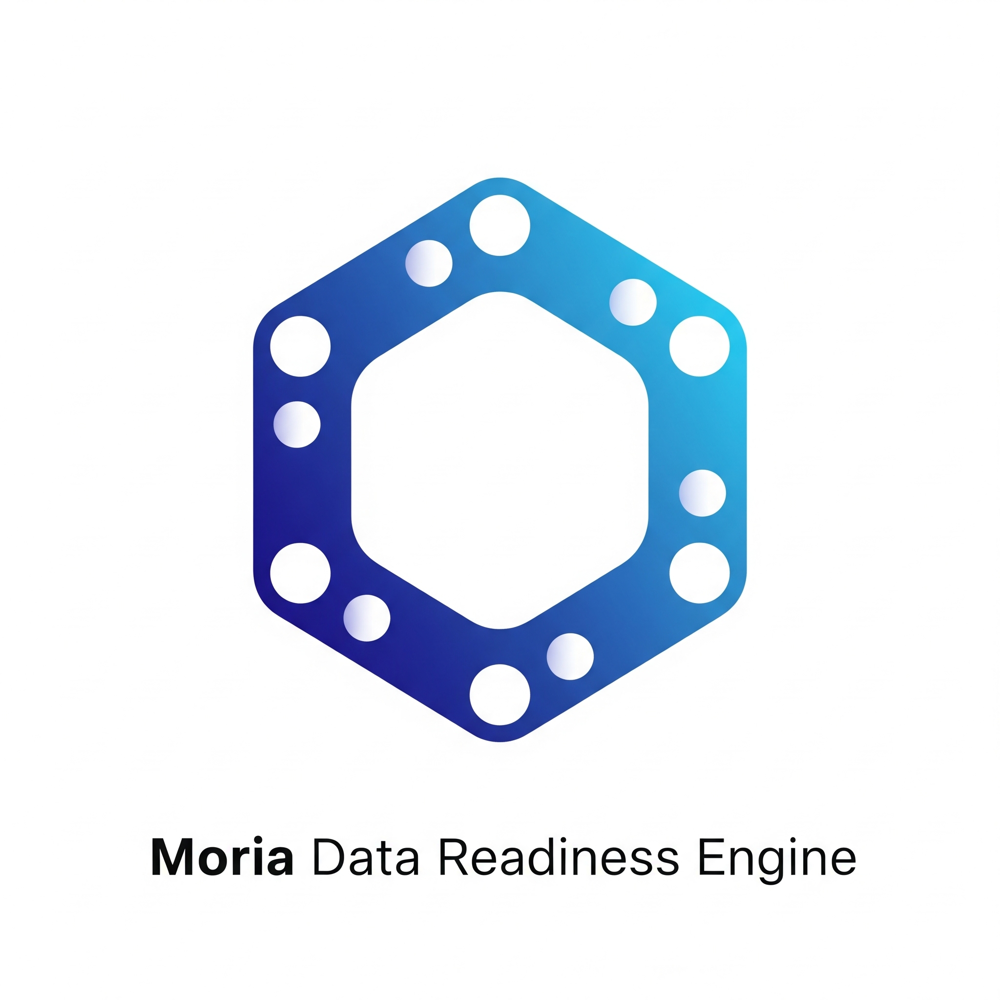
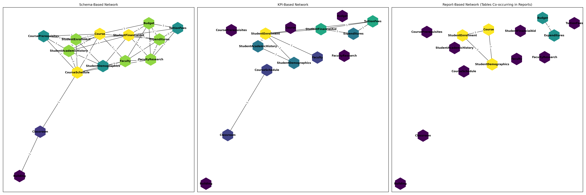

# Moria Data Readiness Engine

⭐️ If you like this project, give it a star!
Curious about our platform? [Visit us](https://moria-ai-labs.github.io/) 



>Going beyond data quality—connecting the dots between data and KPIs to ensure the data readiness you need to solve your most business-critical challenges.

The Moria Data Readiness Engine is a tool designed to analyze relationships and interconnectivity between datasets. It provides insights into schema relationships, KPI-based connections, and network visualizations to help users understand their data better.

---


## Features
- **Schema Analysis**: Analyze relationships between tables based on shared fields.
- **KPI-Based Analysis**: Identify connections between tables based on shared KPIs.
- **Report-Based Analysis**: Visualize and analyze how tables are connected through report requirements.
- **Network Visualization**: Generate interactive and static visualizations of schema, KPI, and report-based networks.
- **Graph-Theory Insights**: Leverage graph-theory algorithms (such as centrality measures, community detection, and path analysis) to identify the most important nodes (tables) and highlight critical missing links or connections in your data network. This approach helps uncover gaps, bottlenecks, or opportunities to strengthen data integration across datasets.
- **Customizable Workflows**: Easily extendable for different datasets and use cases.

---

## Project Structure
- `moria_engine/`: Core package containing the engine's logic.
  - `analysis/`: Functions for data analysis and visualization (schema, KPI, and report networks).
    - `graph_visualizer.py`: Visualization utilities for schema, KPI, and report networks.
    - `graph_explainer.py`: Graph-theory-based analysis and explanation functions.
    - `data_transformers.py`: Functions to build adjacency matrices and transform data for analysis.
  - `loaders/`: Data loaders and preprocessors.
    - `load_json_schema.py`: Loader for schema JSON files.
    - `load_json_kpis.py`: Loader for KPI JSON files.
    - `load_json_reports.py`: Loader for report JSON files.
  - `models/`: Advanced network analysis and characterization algorithms.
- `tests/`: Unit and integration tests for the project.
- `notebooks/`: Jupyter notebooks for experimentation and prototyping.
- `data/`: Raw and processed datasets.
- `docs/`: Documentation and guides.

---

## Installation
1. Clone the repository:
   ```bash
   git clone https://github.com/moria-ai-labs/data_readiness.git
   cd data_readiness 
   ```
2. Create a virtual environment (recommended)

3. Install dependencies:
   ```bash
   pip install -r requirements.txt
   ```

---

## Usage

To get started with the Moria Data Readiness Engine, you can use the following examples to generate schema-based and KPI-based matrices from your data:

### Schema-Based Matrix

```python
import sys, os

# Add the project directory to sys.path PATH
project_path = PATH_TO_PROJECT_DIRECTORY
if project_path not in sys.path:
    sys.path.append(project_path)

import pandas as pd
from moria_engine.analysis.data_transformers import build_common_fields_matrix_schema

# Example DataFrame - Three tables, three data domains: Table1 and Table2 share the same Key Field - Field2
df_schema = pd.DataFrame({
    "domain_name": ["Domain1", "Domain1", "Domain2","Domain3"],
    "table_name": ["Table1", "Table1","Table2", "Table3"],
    "field_name": ["Field1", "Field2", "Field2", "Field3"]
})

# Generate the schema-based matrix
matrix, table_names, table_to_domain, G = build_common_fields_matrix_schema(df_schema)

# Expected Output - Table1 and Table2 are connected via Field2; Table3 is disconnected - no common fields
array([[0, 1, 0],
       [1, 0, 0],
       [0, 0, 0]])
```

### KPI-Based Matrix

```python
import pandas as pd
from moria_engine.analysis.data_transformers import build_common_fields_matrix_kpis

# Example DataFrame - Two KPIs, three domains, three tables. Table2 and Table3 belong to KPI2. Table1 is disconnected.
df_kpis = pd.DataFrame({
    "kpi_name": ["KPI1", "KPI1","KPI2","KPI2"],
    "domain_name": ["Domain1", "Domain1", "Domain2","Domain3"],
    "table_name": ["Table1", "Table1","Table2", "Table3"],
    "field_name": ["Field1", "Field2", "Field2", "Field3"]
})

# Generate the KPI-based matrix
matrix, table_names, table_to_domain, table_to_kpi = build_common_fields_matrix_kpis(df_kpis)

# Expected Output - Table2 and Table3 are connected via KPI2. Table1 is disconnected
```

You can use the loader functions to bring your own Schema and KPI data via json or csv. The required format for the csv is illustrated above. The required format for json is found in the documentation [TODO]


These examples demonstrate how to import the necessary functions, prepare your data in DataFrames, and generate the schema-based and KPI-based matrices, which can be used for further analysis and visualization.


### Network Analysis and Advance Usage

#### Load test data 
```python
from moria_engine.data import loaders

# Load test data 
df_kpis = loaders.load_json_kpis('../data/test/c003a_lambengolmor/20250601-hacp-c003_lambengolmor-kpi_details.json')
df_schema = loaders.load_json_schema('../data/test/c003a_lambengolmor/20250601-hacp-c003_lambengolmor-data_domains_schema.json')
```

#### Visualize and Compare Schema and KPI Networks
```python 
from moria_engine.analysis.graph_visualizer import visualize_combined_networks

# Visualize both networks side by side with consistent node positions
visualize_combined_networks(df_schema, df_kpis)
```

#### Identify most critical missing link
```python
import networkx as nx
from moria_engine.analysis.data_transformers import build_common_fields_matrix_kpis
from moria_engine.models.network_characterization import find_max_entropy_shift_link

# Build the KPI-based adjacency matrix and graph
matrix, table_names, table_to_domain, table_to_kpi = build_common_fields_matrix_kpis(df_kpis)

# Create a graph with table names as nodes
G = nx.from_numpy_array(matrix, create_using=nx.Graph())
mapping = {i: table_names[i] for i in range(len(table_names))}
G = nx.relabel_nodes(G, mapping)

# Find the missing link that maximizes the entropy shift
best_u, best_v, max_shift = find_max_entropy_shift_link(G)
print(f"Best missing link to add: ({best_u}, {best_v}) with entropy shift: {max_shift:.4f}")
```

#### Compare Centrality and Identify Critical Nodes
```python
from moria_engine.models.network_characterization import find_max_betweenness_shift_node

# Find the node whose removal most impacts network betweenness centrality
critical_node, max_betweenness_shift = find_max_betweenness_shift_node(G)
print(f"Node with max betweenness shift when removed: {critical_node} (shift: {max_betweenness_shift:.4f})")
```
### Visualize and Compare Schema, KPI, and Report Networks

The `visualize_combined_networks_skr` function allows you to visually compare the relationships between tables as defined by your schema, KPIs, and report requirements—all side by side, with consistent node positions for easy comparison.

#### Example Usage

```python
from moria_engine.analysis.graph_visualizer import visualize_combined_networks_skr

# Assume you have loaded your data into the following DataFrames:
# df_schema: columns ['domain_name', 'table_name', 'field_name']
# df_kpis: columns ['kpi_name', 'domain_name', 'table_name']
# df_reports: output of load_json_reports, columns include ['report_name', 'table_name', ...]

visualize_combined_networks_skr(df_schema, df_kpis, df_reports)
```

This will display three network graphs side by side:
- **Schema-Based Network:** Shows table relationships based on shared fields in your schema.
- **KPI-Based Network:** Shows table relationships based on shared KPIs.
- **Report-Based Network:** Connects tables that are required together in the same report.

Each network uses the same node layout, making it easy to spot similarities and differences in connectivity across your data landscape.



## Bring your own data - Loading Data via CSV and JSON

The Moria Data Readiness Engine supports loading your schema, KPI, and report data from both CSV and JSON files. The provided loader functions convert your data into Pandas DataFrames for further analysis.

### Loading CSV Data

For tabular data in CSV format, use the `load_csv` function:

```python
from moria_engine.data.loaders import load_csv

# Load a CSV file into a DataFrame
df = load_csv("path/to/your_file.csv")
```

The CSV should have columns as required for your workflow (for example: `domain_name`, `table_name`, `field_name` for schema data).

---

### Loading JSON Data

For JSON data (including both flat and nested structures), use the specific loader functions:

#### 1. Generic JSON (flat or nested)
```python
from moria_engine.data.loaders import read_json

# Load a JSON file as a Python object (dict or list)
data = read_json("path/to/your_file.json")
```

#### 2. Schema Data (nested JSON)

If your schema is in a nested JSON format, use:

```python
from moria_engine.data.loaders import load_json_schema

# Load a schema JSON file into a DataFrame
df_schema = load_json_schema("path/to/your_schema.json")
```

This function will flatten nested structures into columns: `domain_name`, `table_name`, `field_name`.

#### 3. KPI Data (nested JSON)
```python
from moria_engine.data.loaders import load_json_kpis

# Load a KPI JSON file into a DataFrame
df_kpis = load_json_kpis("path/to/your_kpis.json")
```

---

### Example

```python
from moria_engine.data import loaders

# Load schema from CSV
df_schema = loaders.load_csv("data/schema.csv")

# Load KPIs from JSON
df_kpis = loaders.load_json_kpis("data/kpis.json")
```

---

**Note:**  
- Ensure your data files match the expected structure. For examples, see the documentation and `notebooks/` folder.
- CSV files should have headers matching the expected column names.
- JSON files can be nested; loader functions will flatten them as needed.

---

### Contributing
We welcome contributions to the Moria Data Readiness Engine! To contribute:

Fork the repository.
Create a new branch for your feature or bugfix.
Submit a pull request with a clear description of your changes.
Please ensure all tests pass before submitting your pull request:

pytest

### License
This project is licensed under the MIT License. See the LICENSE file for details.

### To Do
- Fix output from moria_engine.analysis.data_transformers import build_common_fields_matrix_schema to build_common_fields_matrix_kpis

### FAQ
What datasets can I use with this engine?
The engine is designed to work with tabular datasets in CSV or JSON format.

Can I extend the analysis to include other types of relationships?
Yes, the engine is modular and can be extended to include custom analysis functions.

## Acknowledgments
Special thanks to the contributors and the MORIA AI Labs team for their support and guidance.
